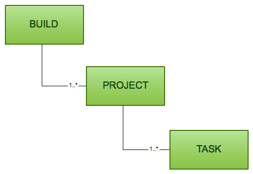

Gradle 是一种构建工具，它抛弃了基于XML的构建脚本，采用一种基于Groovy的内部领域的特定语言。
## 安装 Gradle
离线下载完整安装包，或使用 gradle 自动下载安装。
* 下载完整安装包，并解压
* 运行`gradle.bat`(windows环境下)
完成后将 gradle 安装目录加入到环境变量

## 构建简介
  在 Gradle 中，有两个基本概念：**项目**与**任务**
  * 项目（Projects）是构构建产物(如 jar 包)或实施产物(将应用部署到生产环境)。
  * 任务（Tasks）是不可分的最小工作单元，执行构建工作。
  每一个构建都可以由一个或多个项目构成，一个项目到底代表什么依赖于你想用 Gradle 做什么，而每一个项目又是由一个或多个任务构成的，一个任务代表一些更加细代化的构建。



对 Gradle 进行配置
* Gradle 构建脚本(build.gradle)：指定一个项目和它的任务。
* Gradle属性文件(gradle.properties):配置构建属性。
* Gradle 设置文件(gradle.settings)：描述参与构建的项目。

## 使用 Gradle 插件
Gradle 的设计理念是，所有有用的特性都由 Gradle 插件提供：
* 在项目中添加新任务
* 为新加入的任务提供默认的配置
* 加入新的属性
* 为项目加入新的依赖
为项目加入 gradle 插件时，我们可以根据名称或类型来指定 Gradle 插件：
```gradle
apply plugin:'foo'
```
