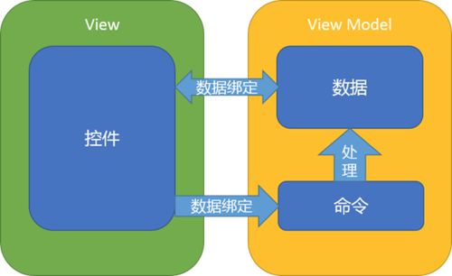

常见开发模式和特点

### MVC

>View ：XML布局文件
>
>Model ：实体模型（数据的获取、存储，数据状态变化）
>
>Controller ：对应于Activity，处理数据、业务和UI

Android中纯粹作为View的XML视图功能太弱，大量处理View的逻辑只能写在Activity中，这样Activity就充当了View和Controller两个角色，这个MVC结构最终其实只是一个Model-View（Activity:View&Controller）的结构。

### MVP

> View ：对应于Activity和XML，负责View的绘制以及与用户的交互
>
> Mode ：实体模型
>
> Presenter ：负责完成View与Model间的交互和业务逻辑

通过一个抽象的View接口（不是真正的View层），将Presenter层与真正的View层进行解耦，解决Activity同时充当View和Controller的问题。

Presenter持有该View的接口，	对该接口进行操作，而不是直接操作View层，这样就可以把视图操作和业务逻辑解耦，从而让Activity成为真正的View层。

MVP是以UI和事件为驱动的传统模型，数据都是被动地通过UI控件做展示，但是由于数据的时变性，我们希望数据能更有活性，由数据来驱动UI

### MVVM

>View ：对应于Activity和XML，负责View的绘制以及与用户的交互
>
>Model ：实体模型
>
>ViewModel ：负责完成View与Model间的交互，负责业务逻辑

MVVM的目标和思想与MVP类似，利用数据绑定（Data Binding）、依赖属性、命令（Command）、路由事件（Route Event）等新特性，打造了一个更加灵活、高效的架构

**数据驱动**

数据变化后会自动更新UI，UI的改变也能自动反馈到数据层，数据成为主导因素。这样MVVM层在业务逻辑处理中只要关心数据，不需要直接和UI打交道。

**低耦合度**

MVVM模式中，数据是独立于UI的。

数据和业务逻辑牌一个独立的ViewModel中，ViewModel只需要关注数据和业务逻辑，不需要和UI或者控件打交道。ViewModel不涉及任何和UI相关的事，也不持有UI控件的引。

**更新UI**

在MVVM中，数据发生变化后，我们在工作线程直接修改（在数据是线程安全的情况下）ViewModel的数据即可，不需要考虑线程问题。

**团队协作**

由于View和ViewModel之间的松散耦合，可以将UI(XML和Activity)和ViewModel分工完成。

**可复用**

一个ViewModel可以复用到多个View中。

**单元测试**

UI的单元测试或业务逻辑的单元测试都是低耦合的，可以方便进行单元测试。

### 如何构建MVVM应用框架

#### 如何分工

> View

View层做的就是和UI相关的工作，我们只在XML、Activity、Fragment写View层的代码，View层不做和业务相关的事，也就是我们在Activity不写业务逻辑和业务数据的代码。**View层不做任何业务逻辑、不涉及操作数据、不处理数据，UI和数据严格的分开**

> ViewModel

ViewModel只做和业务逻辑和业务数据相关的事，不做任何UI相关的事，ViewModel层不会持有任何控件的引用。ViewModel层只专注于业务的逻辑处理，对数据进行操作，通过DataBinding框架自动更新UI和获取View层反馈给ViewModel层的数据。通过BindingAdapter将事件封装成Command，使用ReplyCommand进行处理。

> Model

数据的获取、存储、数据状态变化都是Model层的任务。Model层包括实体模型（bean），Retrofit的Service，获取网络数据的接口，本地存储接口，数据变化监听等。Model提供数据获取接口供ViewModel调用，经数据转换和操作并最终映射绑定到View层某个UI元素的属性上。

### 如何协作

966283-78b410b9af8b18fa](966283-78b410b9af8b18fa.png)

#### ViewModel与View的协作




View与ViewModel通过绑定的方式连接在一起，绑定分成两种：数据绑定和命令绑定。

---

如何进行数据绑定和命令绑定

---


ViewModel类下面一般包含5个部分：

>Context	（上下文）
>
>Model	(数据源 Java Bean)
>
>Data Field	（数据绑定）
>
>Command	（命令绑定）
>
>Child ViewModel		（子ViewModel）

```java
//context
private Activity context;

//model（数据源 Java Bean）
private NewsService.News news;
private TopNewsService.News topNews;

//数据绑定，绑定到UI的字段（data field）
public final ObservableField<String> imageUrl = new ObservableField<>();
public final ObservableField<String> html = new ObservableField<>();
public final ObservableField<String> title = new ObservableField<>();
// 一个变量包含了所有关于View Style 相关的字段
public final ViewStyle viewStyle = new ViewStyle();


//命令绑定（command）
public final ReplyCommand onRefreshCommand = new ReplyCommand<>(() -> {    

})
public final ReplyCommand<Integer> onLoadMoreCommand = new ReplyCommand<>((itemCount) -> { 

});


//Child ViewModel
public final ObservableList<NewItemViewModel> itemViewModel = new ObservableArrayList<>();

/** * ViewStyle 关于控件的一些属性和业务数据无关的Style 可以做一个包裹，这样代码比较美观，
ViewModel 页面也不会有太多太杂的字段。 **/
public static class ViewStyle {    
   public final ObservableBoolean isRefreshing = new ObservableBoolean(true);    
   public final ObservableBoolean progressRefreshing = new ObservableBoolean(true);
}
```

Context：

1、绑定生命周期：访问网络时防止请求返回时Activity已经销毁等异常，将网络请求绑定到当前页面的生命周期中。

2、在两个ViewModel中通过Messenger来传递信息时需要用到Context

3、使用其它工具类时可以用到Context

Model：

这里的Model指Bean，ViewModel要把数据映射到UI中可能需要对Model的数据拷贝和操作，拿Model的字段生成对应的ObservableField然后绑定到UI，这里有必要在一个ViewModel中保留原始的Model引用。

Data Field：

需要绑定到控件上的`ObservableField`字段

可以将一些绑定的控件的style属性的字段进行分类和包裹，将与业务数据和逻辑相关的属性如title,imageUrl,name等放在一起。

Command：

对事件的处理（点击，滑动等），在XML布局文件中通过`bind:onLoadMoreCommand="@{ViewModel.LoadMoreCommand}"`绑定。

```xml
<android.support.v7.widget.RecyclerView
	android:layout_width="match_parent"
	android:layout_height="match_parent"
	bind:onLoadMoreCommand="@{ViewModel.LoadMoreCommand}"/>
```

Child ViewModel

在View里嵌套其它的ViewModel。例如在一个Activity中有两个Fragment，ViewModel是以业务划分的，两个Fragment处理不同的业务，需要两个不同的ViewModel，而这两个ViewModel都在Activity对应的ViewModel中。`AdapterView`如`ListView`，`RecyclerView`，`ViewPager`等中的每一个item都对应一个ViewModel，，然后在当前的ViewModel通过ObservableList持有引用。

```
//Child ViewModel public final
ObservableList<ItemViewModel> itemViewModel 
= new ObservableArrayList<>();
```

ViewModel和View之间仅仅只有绑定的关系，View层需要的属性和事件处理都在在XML中进行绑定，ViewModel层不会操作UI，只是根据业务要求处理数据，这些数据自动映射到View层控件的属性上。

弹出Dialog业务逻辑的实现：

```java
public class MainViewModel implements ViewModel {

  //true的时候弹出Dialog，false的时候关掉dialog
  public final ObservableBoolean isShowDialog 
    = new ObservableBoolean();

}

// 在View层做一个对isShowDialog改变的监听
public class MainActivity extends RxBasePmsActivity {

private MainViewModel mainViewModel;

@Override
protected void onCreate(Bundle savedInstanceState) {

mainViewModel.isShowDialog.addOnPropertyChangedCallback(new android.databinding.Observable.OnPropertyChangedCallback() {
      @Override
      public void onPropertyChanged(android.databinding.Observable sender, int propertyId) {
          if (mainViewModel.isShowDialog.get()) {
               dialog.show();
          } else {
               dialog.dismiss();
          }
       }
    });
 }

}
```

对`ObservableField`做监听，然后根据数据的变化做相应UI的改变，业务层ViewModel根据业务处理数据，以数据来驱动。

#### ViewModel与Model的协作

ViewModel通过传参数到Model层获取数据（网络或数据库等），然后把Model的部分数据映射到ViewModel的一些字段（ObservableField），并在ViewModel中保留这个Model的引用。

```java
 //Model
 private NewsDetail newsDetail;

 private void loadData(long id) {  
   //  Observable<Bean> 用来获取网络数据
   Observable<Notification<NewsDetailService.NewsDetail>>   newsDetailOb =    RetrofitProvider.getInstance()
                  .create(NewsDetailService.class)   
                  .getNewsDetail(id)                   
                  .subscribeOn(Schedulers.io())      
                  .observeOn(AndroidSchedulers.mainThread())
                 // 将网络请求绑定到Activity 的生命周期
                  .compose(((ActivityLifecycleProvider) context).bindToLifecycle()) 
                 //变成 Notification<Bean> 使我们更方便处理数据和错误
                  .materialize().share();  

 // 处理返回的数据
   newsDetailOb.filter(Notification::isOnNext)         
               .map(n -> n.getValue())    
               // 给成员变量newsDetail 赋值，之前提到的5种变量类型中的一种（model类型）        
               .doOnNext(m -> newsDetail = m)   
               .subscribe(m -> initViewModelField(m));

 // 网络请求错误处理
    NewsListHelper.dealWithResponseError(
      newsDetailOb.filter(Notification::isOnError)        
                  .map(n -> n.getThrowable()));
}

//Model -->ViewModel
private void initViewModelField(NewsDetail newsDetail) {  
     viewStyle.isRefreshing.set(false);   
     imageUrl.set(newsDetail.getImage());    
     Observable.just(newsDetail.getBody())
            .map(s -> s + "<style type=\"text/css\">" + newsDetail.getCssStr())           
            .map(s -> s + "</style>")            
            .subscribe(s -> html.set(s));   
     title.set(newsDetail.getTitle());
 }
```

---

大写的懵

---

#### ViewModel与ViewModel的协作

> Messenger

用于ViewModel与ViewModel之间交换数据和通信。

```java
combineRequestOb.filter(Notification::isOnNext)        
.map(n -> n.getValue())        
.map(p -> p.first)        
.filter(m -> !m.getTop_stories().isEmpty())        
.doOnNext(m ->Observable.just(NewsListHelper.isTomorrow(date)).filter(b -> b).subscribe(b -> itemViewModel.clear())) 
//获取网络数据 ，通过send把数据传过去
.subscribe(m -> Messenger.getDefault().send(m, TOKEN_TOP_NEWS_FINISH));

```

```java
//接收数据并处理
Messenger.getDefault().register(activity, NewsViewModel.TOKEN_TOP_NEWS_FINISH, TopNewsService.News.class, (news) -> {
// to something....
}
```

```java
//避免内存泄露，在onDestroy()取消注册
@Override
protected void onDestroy() {    
	super.onDestroy();      
	Messenger.getDefault().unregister(this);
 }
```

