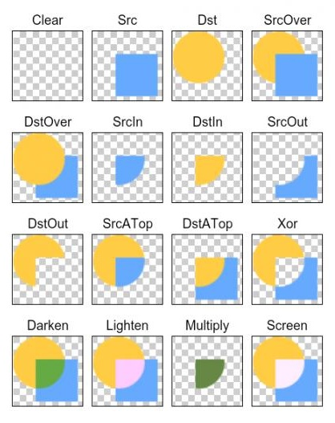

## 屏幕尺寸信息

### 屏幕参数

大小：对角线长度

分辨率：手机屏幕的像素点，形式为宽上的像素点*高上的像素点

ppi(dpi)：每英寸像素，对角线像素点数除以屏幕大小。

### 系统屏幕密度

| 密度   | ldpi    | mdpi    | hdpi    | xhdpi    | xxhdpi    |
| ---- | ------- | :------ | ------- | -------- | --------- |
| 密度值  | 120     | 160     | 240     | 320      | 480       |
| 分辨率  | 240*320 | 320*480 | 480*800 | 720*1080 | 1080*1920 |

### 独立像素密度

使用mdpi即密度值为160的屏幕作为标准，规定1dp为1px，其它屏幕通过比例进行换算。

如在xhdpi中1dp为2px。

| ldpi | mdpi | hdpi | xhdpi | xxhdpi |
| ---- | ---- | ---- | ----- | ------ |
| 3    | 4    | 6    | 8     | 12     |

### 单位转换

```java
// dp/sp转换成px
protected int dp2px(int dp){
  return (int)TypedValue.applyDimension(TypedValue.COMPLEX_UNIT_DIP,
                                       dp,getResource().getDisplayMetrics());
}
protected int sp2px(int sp){
  return (int) TypedValue.applyDimension(TypedValue.COMPLEX_UNIT_SP,
                                        sp,getResource().getDisplayMetrics());
}
// px转换成dp
public static px2dp(Context,foloat pxValue){
  final float scale = scale = context.getResources().getDisplayMetrics().density;
  return (int)(dipValue*scale+0.5f);
}
// px转换成sp值
public static int px2sp(Context context,float pxValue){
  final float fontScale = context.getResource().getDisplayMetricd().scaledDensity;
  return (int)(pxValue/fontScale+0.5f);
}
```

## 2D绘图

系统通过提供的`Canvas`对象来提供绘图方法。它提供了各种绘制图像的API。

`drawPoint`，`drawLine`，`drawRect`，`drawVertices`，`drawArc`，`drawCircle`

`Paint`用于控制绘制的样式：

* setAntiAlisa();	设置画笔的锯齿效果
* setColor();               设置画笔的颜色
* setARGB();               设置画笔的ARGB值
* setAlpha();                设置画笔的Alpha值
* setTEextSize();          设置字体的尺寸
* setStyle();                    设置画笔的风格
* setStrokeWidth();        设置空心边框的宽度

不同功能的画笔结合不同的绘图API从而实现不同的绘图效果。

## Android XML绘图

* Bitmap

```xml
<?xml version="1.0" encoding="utf-8"?>
<bitmap xmlns:android="http://schemas.android.com/apk/res/android"
        android:src="@drawable/image"/>
```

通过这样引用图片就可以将图片直接转换成了Bitmap

* Shape

通过Shape可以在XML中绘制各种形状

```xml
通过渐变实现阴影效果
<?xml version="1.0" encoding="utf-8"?>
<shape xmlns=http://schemas.android.com/apk/res/android
       android:shape=["rectange"|"oval"|"line"|"ring"]>
	<gradient android:startColor="#FF5DA2FF"
              android:endColor="#805FBBFF"
              android:angle="45"/>
  	<padding android:left="7dp"
             android:top="7dp"
             android:right="7dp"
             android:bottom="7dp"/>
  <corners android:radius="8dp"/>
</shape>
```

* Layer

通过Layer实现图层的概念

```xml
<?xml version="1.0" encoding="utf-8"?>
<layer-list xmlns:android="http://schemas.android.com/apk/res/android">
	<item android:drawable=""></item>
  	<item android:drawable=""></item>
</layer-list>
```

* Selector

实现静态绘图中的事件反馈，通过给不同的事件设置不同的图像，从而在程序中根据用户输入，返回不同的效果

```xml
<?xml version="1.0" encoding="utf-8"?>
<selector xmlns:android="http://schemas.android.com/apk/res/android">
	<item android:drawable=""></item>
  	<item android:drawable="" android:atate_window_focused="false"></item>
  	<item android:stated_focused="false" android:stated_pressed="true" android:drawable=""></item>
  	<item android:state_selected="true" android:drawable=""></item>
  	<item android:state_focused="true" android:drawable=""></item>
</selector>
```

使用selector不用在程序中修改点击的唤回就能实现触摸的反馈。

## Android 绘图技巧

### Canvas

`Canvas.save()`	将之前所有的已绘制图像保存起来，让后续的操作好像在一个新的图层上操作一样。

`Canvas.restore()`	将`save`之前和之后绘制的图层进行合并

`Canvas.translate()`	将坐标系进行平移

`Canvas.rotate()`		将坐标系进行翻转

### Layer图层

在Android中，使用`saveLayer()`来创建一个图层，图层同样是基于栈结构来进行管理的.

通过调用`saveLayer()`方法、`saveLayer()`方法将一个图层入栈，使用`restore()`、`restoreToCount()`方法将一个图层出栈。入栈时后面所有的操作都发生在这个图层上，而出栈时则会把图像绘制到上层Canvas上。

## 图像处理之色彩特效处理

### 色彩矩阵分析

在色彩处理中，通常使用以下三个角度来描述一个图像：

* 色调——物体传播的颜色
* 饱和度——颜色的纯度，从0（灰）到100%来进行描述
* 高度——颜色的相对明暗程度

在Android中，系统使用一个色矩阵——`ColorMatrix`，来处理图像的这些色彩效果。Android中的颜色矩阵是一个4×5的数字矩阵，它用来对图片的色彩进行处理，对于每个像素点都有一个颜色分量矩阵用来保存颜色的ARGB值。

使用`ColorMatrix`处理颜色效果：

```java
//创建ColorMatrix对象
ColorMatrix colorMatrix = new ColorMatrix();
```

* 色调

`setRotate(int axis,float degree)`设置颜色的色调，第一个参数系统分别使用0/1/2来代表Red、Green、Blue 三种颜色的处理，第二个参数是需要处理的值。

```java
//给ARGB设置不同的色调值
hueMatrix.setRotate(0,hue0);
hueMatrix.setRotate(1,hue1);
hueMatrix.setRotate(2,hue2);
```

* 饱合度

```java
//参数即代表颜色饱合度的值
ColorMatrix saturationMatrix = new ColorMatrix();
saturationMatrix.setSaturation(saturation);
```

* 亮度

```java
ColorMatrix lumMatrix = new OlorMatrix();
lumMatrix.setScale(lum,lum,lum,1);
```

使用`postConcat()`方法来将矩阵的作用效果混合，从而叠加处理效果

```java
ConlorMatrix imageMatrix = new ColorMatrix();
imageMatrix.postConcat(hueMatrix);
imageMatrix.postConcat(hueMatrix);
imageMatrix.postConcat(lumMatrix);
```

例：通过三个`SeekBar`来改变不同的数值，并将数值应用到对应的矩阵中，最后通过`postConcat()`方法来显示混合后的处理效果。

滑动`SeekBar`获取输入值：

```java
@Override
public void onProgressChanged(SeedBar seekBar,int progress,boolean fromUser){
  switch(seekBar.getId()){
    case R.id.seekbarhue:
      mHue = (Progress - MID_VALUE)*1.0F/MID_VALUE*180;
      break:
    case R.id.seekbarSaturation:
      mStauration = progress * 1.0F/MID_VALUE;
      break;
    case R.id.seekbarLum:
      mLum = progress * 1.0F/MID_VALUE;
      break;
  }
  mImageView.setImageBitmap()
}
```

设置图像矩阵：

```java
pulic static Bitmap handleImageEffect(Bitmap bm,float hue,float saturation,float lum){
  Bitmap bmp = Bitmap.createBitmap(bm.getWidth(),bm.getHeight(),Bitmap.Config.ARGB_8888);
  Canvas canvas = new Canvas(bmp);
  Paint paint = new Paint();
  
  ColorMatrix hueMatrix = new ColorMatrix();
  hueMatrix.setRotate(0,hue);
  hueMatrix.setRotate(1,hue);
  hueMatrix.setRotate(2,hue);
  
  ColorMatrix saturatioMatrix =new ColorMatrix();
  saturtionMatrix.setSaturation(saturation);
  
  ColorMatrix lumMatrix = new ColorMatrix();
  lumMatrix.setScale(lum,lum,lum,1);
  
  ColorMatrix imageMatrix = new ColorMatrix();
  imageMartix.postConcat(hueMatrix);
  imageMatrix.postConcat(saturationMatrix);
  imageMatrix.postConcat(lumMatrix);
  paint.setColorFilter(new ColorMatrixColorFilter(imageMatrix));
  //使用setColorFilter方法将通过imageMatrix方法构造的ColorMatrixColorFilter对象传进去，并使用这个画笔来绘制原来的图像，从而将颜色矩阵作用到原图中
  canvas.drawBitmap(bm,0,0,paint);
  return bmp;
}
```

在Android中不允许直接修改原图，	必须通过原图创建一个同样大小的Bitmap，并将原图绘制到该Bitmap中，以一个副本的形式来修改图像。

###  Anroid颜色矩阵

通过修改`ColorMatrix `颜色矩阵的值来实现颜色效果的处理。

在Android中使用一个一维数组来保存矩阵值，并通过`ColorMatrix.set()`将一个一维数组转换成`ColorMatrix`

通过二十个EditText来接收值，转换成颜色矩阵`Matrix`后应用于图片

```java
//获取矩阵值
void getMatrix(){
  for(int i = 0;i < 20 ; i ++){
    mColorMatrix[i] = Float.valueOf(mEts[i].getText().toString());
  }
}
//将矩阵值设置到图像
void setImageMatrix(){
  Mitmap bmp = Bitmap.createBitmap(
  bitmap.getWidth(),bitmap.getHeight(),
    bitmap.Config.ARGB_8888);
  android.graphics.ColorMatrix colorMatrix = new ColorMatrix();
  colorMatrix.set(mColorMatrix);
  Canvas canvas = new Canvas(bmp);
  Paint paint = new Paint();
  paint.setColorFilter(new ColorMatrixColorMatrixFilter(colorMatrix));
  canvas.drawBitmap(bitmap,0,0,paint);
  mImageView.setImageBitmap(bmp);
}
```

### 常用图像颜色矩阵处理效果

***灰度效果***

颜色矩阵：

| 0.33F | 0.59F | 0.11F | 0    | 0    |
| ----- | ----- | ----- | ---- | ---- |
| 0.33F | 0.59F | 0.11F | 0    | 0    |
| 0.33F | 0.59F | 0.11F | 0    | 0    |
| 0     | 0     | 0     | 1    | 0    |

***图像反转***

| -1   | 0    | 0    | 1    | 1    |
| ---- | ---- | ---- | ---- | ---- |
| 0    | -1   | 0    | 1    | 1    |
| 0    | 0    | -1   | 1    | 1    |
| 0    | 0    | 0    | 1    | 0    |

***怀旧效果***

| 0.393F | 0.769F | 0.189F | 0    | 0    |
| ------ | ------ | ------ | ---- | ---- |
| 0.349F | 0.686F | 0.168F | 0    | 0    |
| 0.272F | 0.534F | 0.131F | 0    | 0    |
| 0      | 0      | 0      | 1    | 0    |

***去色效果***

| 1.5F | 1.5F | 1.5F | 0    | -1   |
| ---- | ---- | ---- | ---- | ---- |
| 1.5F | 1.5F | 1.5F | 0    | -1   |
| 1.5F | 1.5F | 1.5F | 0    | -1   |
| 0    | 0    | 0    | 1    | 0    |

***高饱和度***

| 1.438F  | -0.122F | -0.016F, | 0    | -0.03F |
| ------- | ------- | -------- | ---- | ------ |
| -0.062F | 1.378F  | -0.016F  | 0    | 0.05F  |
| -0.062F | -0.122F | 1.483F   | 0    | -0.02F |
| 0       | 0       | 0        | 1    | 0      |

### 像素点分析

通过改变每个像素点具体的ARGB值，来达到处理一张图像效果的目的。

在Android中使用`Bitmap.getPixels()`方法来提取整个Bitmap中的像素点，并保存到一个数组中。

```java
/*
bitmap.getPixels(pixels,offset,stride,x,y,width,height);
*@params:pixels 接收位图颜色值的数组
*@params:offset 写入到pixels[]中的第一个像素索引值
*@params:stride pixels[]中的行间距
*@params:x 从位图中读取的第一个像素的x坐标
*@params:y 从位图中读取的第一个像素的y坐标
*@params:height 读取的行数
*/
bitmap.getPixels(oldPx,0,bm.getWidth,0,0,width,height);
//获取每个像素具体的ARGB值
color=oldPx[i];
r=Color.red(color);
g=Color.green(color);
b=Color.blue(color);
a=Color.alpha(color);
```

获取具体的的颜色值后，就可以通过相应的算法来修改它的ARGB值，从而来重构一张图像。

```
rn=(int)(0.393*r)+(0.769*g)+(0.189*b)
gn=(int)(0.349*r)+(0.686*g)+(0.168*b)
bn=(int)(0.272*r)+(0.534*g)+(0.131*b)
```

```java
//将新的RGBA值合成像素点
newPx[i] = Color.argb(a,rm,gn,bn);
//将处理之后的像素点重新set给bitmap
bmp.setPixels(newPx,0,0,width,height);
```

### 常用图像像素点处理效果

***底片效果***

```java
//对像素点颜色进行处理
B.r=255-B.r;
B.g=255-B.g;
B.b=255=B.b;
```

具体实现：

```java
public Bitmap bitmaphandleImageNegatice(Bitmap bitmap){
	int width,height;
    width = bitmap.getWidth();
    height = bitmap.getHeight();
    int color;
    int a,r,g,b;

    int[] oldPx = new int[width*height];
    int[] newPx = new int[width*height];
    bitmap.getPixels(oldPx,0,width,0,0,width,height);
    for (int i = 0 ;i < width*height ; i++){
       color = oldPx[i];
       a = Color.alpha(color);
       r = Color.red(color);
       g = Color.green(color);
       b = Color.blue(color);
       r=255-r;b=255-b;g=255-b;

       if (r>255)r=255;else if(r<0)r=0;
       if(g>255)g=255;else if(g<0)g=0;
       if(b>255)b=0;else if (b<0)b=0;
       newPx[i]=Color.argb(a,r,g,b);
        }
   Bitmap bmp = Bitmap.createBitmap(width,height,	  Bitmap.Config.ARGB_8888);
        bmp.setPixels(newPx,0,width,0,0,width,height);
        return bmp;
    }
```

***老照片效果***

```java
r1=(int)(0.393*r+0.769*g+0.189*b);
g1=(int)(0.349*r+0.686*g+0.168*b);
b1=(int)(0.272*r+0.543*g+0.131*b);
```

***浮雕效果***

存在ABC三个像素点，B点对应的浮雕效果：

```java
B.r=C.r-B.r+127;
B.g=C.g-B.g+127;
B.b=C.b-B.b+127;
```

## 图形特效处理

### Android变形矩阵 Matrix

Android中对于图像的图形变换通过一个3×3的矩阵进行处理，每个像素点都表达了其坐标的X、Y信息。
$$
A=
 \left[
 \begin{matrix}
   a & b & c \\
   d & e & f \\
   g & h & i
  \end{matrix}
  \right]
  C=
 \left[
 \begin{matrix}
   X \\
   Y \\
   1
  \end{matrix}
  \right]
    R=
 \left[
 \begin{matrix}
   X~1~\\
   Y~1~\\
   1
  \end{matrix}
  \right]=AC
$$
当用变换矩阵去处理每一个像素点的时候与颜色矩阵的矩阵乘法一样：

X~1~=a×X+b×Y+c

Y~1~=d×X+e×Y+f

1=g×X+h×Y+i

通常情况下使g=h=0，i=1，从而1=g×X+h×Y+i恒成立。

初始矩阵：
$$
\begin{matrix}
   1 &0 & 0 \\
   0 & 1& 0 \\
   0 & 0 & 1
  \end{matrix} \tag{1}
$$
图像的变形处理通常包含四类基本变化

* Translate	平移变换
* Rotate              旋转变换
* Scale                 缩放变换
* Skew                 错切变换

***平移变换***
$$
\left[\begin{matrix}
  x \\
  y\\
   1
  \end{matrix} \right]
  =  
 \left[\begin{matrix}
   1 &0 & dx \\
   0 & 1& dy \\
   0 & 0 & 1
  \end{matrix}\right]
   \left[\begin{matrix}
   {X}_0 \\
    {Y}_0 \\
    1
  \end{matrix}\right]
$$

$$
X={X}_0+dx
$$

$$
Y={X_0}+dx
$$

***旋转变换***

旋转变换即指一个点围绕一个中心旋转到一个新点。
$$
\left[
	\begin{matrix}
	x\\
	y\\
	1
	\end{matrix}
\right]=
\left[
	\begin{matrix}
	cosθ&-sinθ&0\\
	sinθ&cosθ&0\\
	0&0&1
	\end{matrix}
\right]
	\left[
	\begin{matrix}
	{X}_0\\
	{Y}_0\\
	1
	\end{matrix}
	\right]
$$

$$
{X}_0=r cosα \\
{Y}_0=r sinα\\
x=rcos(α+θ)={X}_0cosθ-{Y}_0sinθ\\
y=rsin(α+θ)={Y}_0cosθ+{X}_0sinθ
$$

以任意点O为旋转中心来进行旋转变换：

* 将坐标原点平移支O点
* 对图像进行旋转变换
* 将坐标原点还原

***缩放变换***

将每个点的坐标进行相同比例的缩放，最终形成让整个图像缩放的效果
$$
x={K}_1×{x}_0\\
y={K}_2×{y}_0
$$

$$
\left[
  \begin{matrix}
  x\\
  y\\
  1
  \end{matrix}
\right]
=
\left[
  \begin{matrix}
  {k}_1&0&0\\
  0&{k}_2&0\\
  0&0&1
  \end{matrix}
  \right]
  \left[
  \begin{matrix}
  {X}_0\\
  {Y}_0\\
  1
  \end{matrix}
  \right]
$$

***错切变换***

让所有点的X坐标（或Y坐标）保持不变，而对应的Y坐标（或X坐标）按比例发生平移，且平移的大小和该点	到X轴或（Y轴）的垂直距离成正比。通常包括水平错切与垂直错切。
$$
x={x}_0+{K}_1×{y}_0\\
y={k}_2×{x}_0+{y}0
$$

$$
\left[
  \begin{matrix}
  x\\
  y\\
  1
  \end{matrix}
\right]
=
\left[
  \begin{matrix}
  1&{k}_1&0\\
  {k}_2&1&0\\
  0&0&1
  \end{matrix}
  \right]
  \left[
  \begin{matrix}
  {X}_0\\
  {Y}_0\\
  1
  \end{matrix}
  \right]
$$

***变形矩阵规律***
$$
\left[
 \begin{matrix}
 Scale\_X &Skew\_X&Trans \_X\\
 Skew \_Y&Scale\_Y&Trans \_Y\\
 0&0&1
 \end{matrix} 
\right]
$$

* A和E控制Scale－－缩放变换
* B和D控制Skew－－错切变换
* C和F控制Trans－－平移变换
* A、B、D、E共同控制Rotate－－旋转变换

```java
//初始化变形矩阵
float[] mImageMatrix = new float[];
Matrix matrix = new Matrix();
matrix.setValues(mImageMatrix);
//应用变形矩阵
canvas.drawBitmap(mImageMatrix);
```

Matrix的API：

```java
matriX.setRotate()	//--旋转变换
matriX.setRotate()	//--平移变换
matriX.setScale()	//--缩放变换
matriX.setSkew()	//--错切变换
prexxx() postxxx()		//--矩阵的前乘和后乘
//使用pre/post方法不会重置原矩阵中的值，从而实现矩阵的混合作用
```

```java
matrix.setRotate(45);
matrix.postTranslate(200,200);
//使用矩阵后乘运算，表示当前矩阵乘上参数代表的矩阵
matrix.setTranslate(200,200);
matrix.preRotate(45);
```

### 像素块分析

`drawBitmapMesh()` 把图像分成一个个的小块，然后通过改变每一个图像块来修改整个图像。

```java
drawBitmapMesh(Bitmap bitmap,int meshWidth,int meshHeight,float[] verts,
              int vertOffset,int[] colors, int colorOffset,Paint paint)
  /*
  *@params bitmap 将要扭曲的图像
  *@params meshWidth 需要的横向网格数目
  *@params meshHeight 需要的纵向风格数目
  *@params verts 网格交叉点坐标数组
  *@overtOffset verts数组中开始跳过的(x,y)坐标对的数目
  */
```

`drawBitmapMesh()`方法在图像上横纵各画N-1条线，将图像分成N块，而这横纵各N条线就织成了N×N个点，而每个点的坐标则以x~1~,y~1~,x~2~,y~2~ ...x~n~,y~n~的形式保存在berts数组中，也就是说verts数组的每两位数用来保存一个交织点，第一个是横坐标，第二个是纵坐标。而整个drawBitmapMesh()方法改变图像的方式就是靠这些坐标值的改变来重新定位每一个图像块，从而达到图像效果处理的功能。

例：旗帜飞扬效果

```java
//使图片扭曲
void initView(){
  bitmap = Bitmap.Factory.decodeResource(context.getResource(),R.drawable.test);
float bitmapWidth = bitmap.getWidth();
float bitmapHeight = bitmap.getHeight();
int index = 0;
for(int y = 0; y <= HEIGHT; y++){
  float fy = bitmapHeight * y / HEIGHT;
  for (itn x = 0; x <=WIDTH; x++){
    float fx = bitmapWidth*x/WIDTH;
    orig[index*2+0] = verts[index*2+0]=fx;
    orig [index*2+1] = verts[index*2+1]=fy+100;
    index+=1;
  }
}
}

//实现静态飘扬效果
//使用一个正弦函数sinx来改变交叉纵坐标的值，而横坐标的值不变
private void flagWave(){
  for(int j=0;j<=HEIGHT;j++){
    for(int i=0;i<=WIDTH;i++){
      verts[(j*(WIDTH+1)+i)*2+0]+=0;
      float offsetY = (float)Math.sin((float)i/WIDTH*2*Math.PI);
      verts[(j*(WIDTH+1)+i)*2+1] = 
        orig[(j*WIDTH+i)*2+1]+offsetY*A;
    }
  }
}
//在onDraw方法中绘制图像
canvas.drawBitmapMesh(bitmap,WIDTH,HEIGHT,verts,0,null,0,null);
```

动态效果：

```java
//利用正弦函数的周期性，在获取纵坐标的偏移量时给函数增加一个周期
float offsetY = (float)Math.sin((float)i/WIDTH*2*2*Math.PI+Math.PI*k);
```

在重绘时，将k增加

```java
@Override
protected void onDraw(Canvas canvas){
  flagWave();
  k+=0.1F;
  canvas.drawBitmapMesh(bitmap,WIDTH,HEIGHT,verts,0,null,0,null);
  invalidate();
}
```

## 图像处理之画笔特效处理

### 画笔的高级属性

***PorterDuffXfermode***

PorterDuffXfermode设置的是两个图层交集区域的显示方式，dst是先画的图形，而src是后画的图形。



刮刮卡实现：

```java

```


### Shader

用来实现一系列的渐变、渲染效果

* BitmapShader －位图Shader
* LinearGradient　－线性Shader
* RAdialGradient　－光束Shader
* SweepGradient　－ 梯度Shader
* ComposeShader　－ 混合Shader

`BitmapShader`通过Paint对画布进行指定Bitmap的填充，填充时有几种模式可以选择。

* CLAMP 拉伸--拉伸图片的最后一个像素，不断重复
* REPEAT 重复--横向、纵向不断重复
* MIRROR 镜像--横向不断翻转重复，纵向不断翻转重复

示例：

```java
//用一张图片创建一支具有图像填充功能的画笔，并使用这个画笔绘制一个圆形
mBitmap = BitmapFactory.decodeResource(getResource(),R.drawable.test);
//创建Shader，基模式为CLAMP
mBitampShader = new BitmapShader(mBitmap,Shader.TileMode.CLAMP,Shader.TileMOde.CLAMP);
mPaint = new Paint();
mPaint.setShader(mBitmapShader);
canvas.drawCircle(500,250,200,mPaint)
```

```java
//REPEAT模式画笔
mBitmap = BitmapFactory.decodeResource(getResource(),R.drawable.ic_launcher);
mBitmapShader = new BitmapShader(mBitmap,Shader.TileMode.REPEAT,Shader.TileMode.REPEAT);
mPaint = new Paint();
mPaint.setShader(mBitmapShader);
canvas.drawCircle(500,250,200,mPaint);
```

***LinearShader***

```java
Paint paint = new Paint (0,0,400,400,
                        Color.BLUE,Color.YELLOW,Shader.TitleMode.REPEAT);
canvas.drawRect(0,0,400,400,paint);
//在(0,0)到(400,400)范围内的由蓝色到黄色的渐变效果
```

示例：***具有倒影效果的图片***

```java
//复制原图并进行翻转
mSrcBitmap = BitmapFactory.decodeResource(getResource(),R.drawable.image);
Matrix matrix = new Matrix();
matrix.setScale(1F,-1F);
mRefBitmap = Bitmap.createBitmap(mSrcBitmap,0,0,
mSrcBitmap.getWidth,mSrcBitmap.getHeight(),matrix,true);
```

```java
//绘制原图与倒影图,之后在倒影图上绘制一个同样大小的渐变矩形

```

### PathEffect

***PathEffect***指用各种笔触效果来绘制一个路径。

* CornerPathEffect		使拐角处变圆滑
* DiscretePathEffect        在线段上产生杂点
* DashPathEffect               使用虚线绘制
* PathDashPathEffect        组合特效(两种)

```java
//生成轨迹
mPath = new Path();
mPath.moveto(0,0);
for(int i=0;i<=30;i++){
  mPath.lineTo(i*35,(float)(Math.random()*100));
}
```

```java
//进行绘制
mEffects[0] = null;
mEffects[1] = new ConrnerPathEffect(30);
mEffects[2] = DiscretePathEffect(3.0F,5.0F);
mEffects[3] = DashPathEffect(new float[]{20,10,5,10,10},0);
Path path = new Path();
```

### SurfaceView

与View的对比

* View主要适用于主动更新的情况，而SurfaceView主要适用于被动更新，例如频繁的刷新。
* View在主线程中对画面进行刷新，而SurfaceView通常会通过一个子线程来进行页面的刷新。
* View在绘图时没有使用双缓存机制，而SurfaceView通过会通过一个子线程来进行页面的刷新。

因此需要频繁刷新或刷新时数据处理量比较大时应该使用SurfaceView来代替View。

***SurfaceView的使用***

1. 创建SurfaceView

   创建自定义的SurfaceView继承自SurfaceView，并实现两个接口：`SurfaceHolder.Callback`与`Runnable`

   ```java
   public class SurfaceViewTemplate extends SurfaceView 
     implements SurfaceHolder.Callback,Runnable{
       //实现Callback接口的方法
       //分别对应SurfaceView的创建、改变和销毁的过程。
     	@Override
     	public void surfaceCreate()(SurfaceHolder holder){
         
     	}
     	@Override
     	public void surfaceChanged(SurfaceHolder holder, 
        int format ,int width ,int height){
         
     	}
     	@Override
     	public void surfaceDestory(SurfaceHolder holder){
         
     	}
     	//实现runable接口的方法
     	@Override
     	public void run(){
         
     	}
     }
   ```

2. 初始化SurfaceView

   在自定义SurfaceView的构造方法中，需要对SurfaceView进行初始化。在自定义的SurfaceView中，通常需要定义以下三个成员变量。

   ```java
   private SurfaceHolder mHolder;
   private Canvas mCanvas;	//绘图操作
   private boolean mIsDrawing;//控制子线程
   ```

   初始化方法就是对SurfaceHolder进行初始化，通过以下代码来初始化一个SurfaceHolder对象，并注册SurfaceHolder的回调方法。

   ```java
   mHolder = getHolder();
   mHolder.addCallback(this);
   ```

3. 使用SurfaceView

   通过SurfaceView对象的lockCanvas()方法，就可以获得当前Canvas绘图对象，使用canvas进行绘制操作的方法与在View中一致。注：`lockCanvs()`获取到的canvas对象还是继续上次的那个canvas对象，而不是一个新的对象。通过`drawColor()`进行清屏操作。

   绘制的时候，充分利用SurfaceView的三个回调方法，在surfaceCreated()方法中开启子线程进行绘制，子线程使用一个`while(mIsDrawing)`的循环来来不停的进行绘制，通过lockCanvas()方法获得的Canvas对象进行绘制，并通过unlockCanvasAndPost(mCanvas)方法对画布内容进行提交。

   ```java
   //surfaceView模板代码
   package com.programer.demo;

    import android.content.Context;
    import android.graphics.Canvas;
    import android.util.AttributeSet;
    import android.view.SurfaceHolder;
    import android.view.SurfaceView;

   public class SurfaceViewTemp extends SurfaceView implements 			SurfaceHolder.Callback, Runnable {

      private SurfaceHolder mSurfaceHolder;
      private Canvas mCanvas;
      private boolean mIsDrawing;
    
      public SurfaceViewTemp(Context context) {
          super(context);
          initView();
      }
    
        public SurfaceViewTemp(Context context, 
        AttributeSet attrs) 	{
          super(context, attrs);
          initView();
      }
    
      void initView(){
          mSurfaceHolder = getHolder();
          mSurfaceHolder.addCallback(this);
          setFocusable(true);
          setFocusableInTouchMode(true);
          setKeepScreenOn(true);
          //mSurfaceHolder.setFormat(PixelFormat.OPAQUE);
      }
    
      @Override
      public void surfaceCreated(SurfaceHolder surfaceHolder) {
          mIsDrawing = true;
          new Thread(this).start();
      }
    
      @Override
      public void surfaceChanged(SurfaceHolder surfaceHolder, int i, int i1, int i2) {
    
      }
    
      @Override
      public void surfaceDestroyed(SurfaceHolder surfaceHolder) {
          mIsDrawing = false;
      }
    
      @Override
      public void run() {
          while ( mIsDrawing){
              draw();
          }
      }
      void draw(){
          try {
              mCanvas = mSurfaceHolder.lockCanvas();
              // draw view
          }catch (Exception e){
    
          }
          finally {
              if (mCanvas!=null){
                  mSurfaceHolder.unlockCanvasAndPost(mCanvas);
              }
          }
      }
   }
   ```

   ### SurfaceView实例

   ***正弦曲线***

   不断修改横纵坐标的值，并让它们满足正弦函数即可。使用一个Path对象来保存正弦函数上的坐标点，在子线程的while循环中不断改变横纵坐标值。

   ```java
   @Override
   public void run(){
     while(mIsDrawing){
       draw();
       x +=1;
       y = (int) (100* Math.sin(x*2*Math.PI/180)+400);
       mPath.lineTo(x,y);
     }
   }
   private void draw(){
     try{
       mCanvas = mSurfaceHolder.lockCanvas();
       mCanvas.drawColor(Color.WHITE);
       mCanvas.drawPath(mPath,mPaint);
     }catch(Exception){
       
     }finally{
       if(mCanvas != null){
         mSurfaceHolder.unlockCanvasAndPost(mCanvas);
       }
     }
   }
   ```

   ***绘图板***

   在SurfaceView的onTouchEvent()中将手指滑动路径记录到Path对象中，然后依据Path对象进行绘图。

   ```java
   @Override
   public boolean onTouchEvent(MotionEvent event ){
     int x = (int) event.getX();
     int y = (int) event.getY();
     switch(event.getAction){
       case MotionEvent.ACTION_DOWN:
         mPath.moveTo(x,y);
         break;
       case MotionEvent.ACTION_MOVE:
         mPath.lineTo(x,y);
         break;
       case MotionEvent.ACTION_UP:
         break;
     }
     return true;
   }
   ```

   在draw()方法中进行绘制

   ```java
   draw(){
     try{
     mCanvas = mHolder.lockCanvas();
     mCanvas.drawColor(Color.WHITE);
     mCanvas.drawPath(mPath,mPaint);
    }catch(Exception e){
     
    }
     finally{
       if(mCanvs != null){
         mHolder.unlockCanvasAndPost(mCanvas);
       }
     }
   }
   ```

   ```java
   //在子线程中进行sleep操作，降低刷新的频率
   @Override
   public void run(){
     long start = System.currentTimeMillis();
     while(mIsDrawing){
       draw();
     }
     long end = System.currentTimeMillis();
     //最小刷新时间一般为50-100ms
     //当完成刷新时时间不足100ms，使线程sleep,直至100ms后再进行刷新
     if(end - start < 100){
       try {Thread.sleep(100-(end - start))}
       catch (InterruptedException e){
         e.printStackTrace();
       }
     }
   }
   ```

   ​

