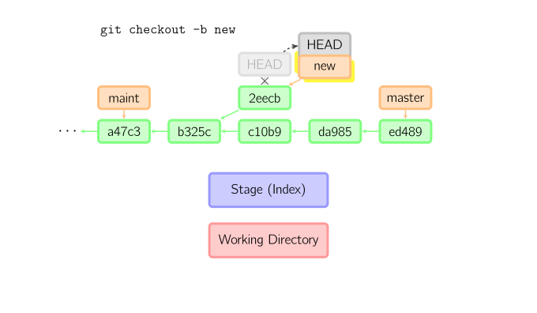

基本用法

* `git add file` 把file文件加入到暂存区域
* `git commit `给暂存区域生成快照并提交
* `git reset`  撤销所有暂存区域文件 `-- file`撤销指定文件在修改
* `git checkout ` 把文件从暂存区复制到工作目录，丢弃本地修改

使用`-p`参数可以进入交互模式

跳过暂存区直接从仓库取出文件或直接提交代码：

* `git commit -a `相当于运行`git add`将当前目录下的所有加入暂存区再运行`git commit`
* `git commit files`进行一次包含最后一次提交加上工作目录中文件快照的提交，并且文件被添加到暂存区
* `git checkout HEAD -- files` 回滚到最后一次提交

## 命令详解

***diff***

查看两次提交间的变动

* `git diff` 工作目录与缓存区的差异
* `git diff --cached` 缓存区与仓库的差异
* `git diff HEAD` 工作目录与仓库中当前分支的差异
* `git diff branch`工作目录与仓库中当前分支的差异 
* `git diff commit1 commit2`查看两次提交间的差异

***commit***

提交时，git用暂存区的文件创建一个新的提交，并把此时的节点设置为父节点。然后把当前分支指向新的提交节点。

即使当前分支是某次提交的祖父节点，git会同样的操作。此时`maint`分支不再是`master`分支的祖父节点。

更改提交：`git commit --amend`使用当前提交相同的父节点进行一次提交，并取消旧的提交。

***checkout***

`checkout`命令用于从历史提交（或暂存区域）中拷贝文件到工作目录 ，也可以 用于切换分支。`git checkout HEAD~ file` 从当前提交节点的父节点中检出文件，`Index`中的内容也会被一并覆盖。`git checkout file`从暂存区中检出。

当给出分支名时，会切换到指定的分支，即HEAD标识会移动到指定的分支。暂存区和工作目录中的内容会和HEAD对应的提交节点一致。在切换分支前需要进行提交`commit`或保存`stage`当前暂存区、工作目录中的内容。

如果既没有指定文件名，也没有指定分支名，而是一个标签、远程分支、SHA-1值或者是像*master~3*类似的东西，就得到一个匿名分支，称作*detached HEAD*（被分离的*HEAD*标识），从而方便的在历史版本间进行切换。

***HEAD标识处于分离状态时的提交操作***

`HEAD`处于分离状态即没有指向任何一个分支时同样可以进行提交操作，但是不会更新到任何已命名的分支。切换分支后，这个提交节点（可能）再也不会被引用到。在切换时使用`-b`选项创建一个新分支来保存这个匿名分支中的内容。

***reset***

`reset`命令把当前分支指向另一个位置，并且有选择的变动工作目录和索引。也用来从历史仓库中复制文件到索引，而不变动工作目录。

给定文件名可以从版本库中检出指定文件到暂存区`Index`中，`--hard`可以使工作目录中的内容也被更新。

***merge***

`merge`命令把不同的分支合并起来，合并前索引并须和当前提交相当。如果另一个分支是当前提交的祖父节点，那么合并命令什么也不做，如果当前提交是另一个分支的祖父节点，则会将当前分支指向另一个分支，这种情况称为`fast-worward`。

否则需要进行真正的合并。把当前提交和另一个提交以及他们的共同祖父节点进行一次三方合并。先保存当前目录和索引，然后和父节点*33104*一起做一次新提交。

