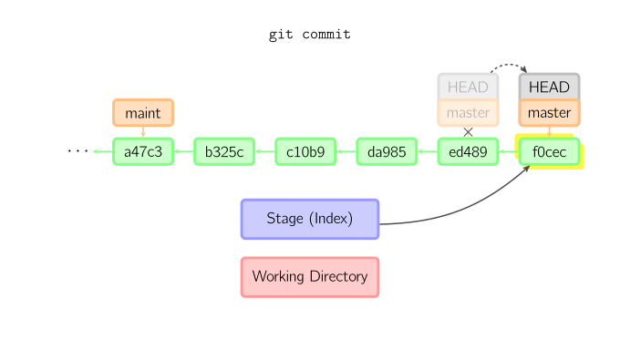

基本用法

* `git add file` 把file文件加入到暂存区域
* `git commit `给暂存区域生成快照并提交
* `git reset`  撤销所有暂存区域文件 `-- file`撤销指定文件在修改
* `git checkout ` 把文件从暂存区复制到工作目录，丢弃本地修改

使用`-p`参数可以进入交互模式

跳过暂存区直接从仓库取出文件或直接提交代码：

* `git commit -a `相当于运行`git add`将当前目录下的所有加入暂存区再运行`git commit`
* `git commit files`进行一次包含最后一次提交加上工作目录中文件快照的提交，并且文件被添加到暂存区
* `git checkout HEAD -- files` 回滚到最后一次提交

## 命令详解

***diff***

查看两次提交间的变动

* `git diff` 工作目录与缓存区的差异
* `git diff --cached` 缓存区与仓库的差异
* `git diff HEAD` 工作目录与仓库中当前分支的差异
* `git diff branch`工作目录与仓库中当前分支的差异 
* `git diff commit1 commit2`查看两次提交间的差异

***commit***

提交时，git用暂存区的文件创建一个新的提交，并把此时的节点设置为父节点。然后把当前分支指向新的提交节点。

